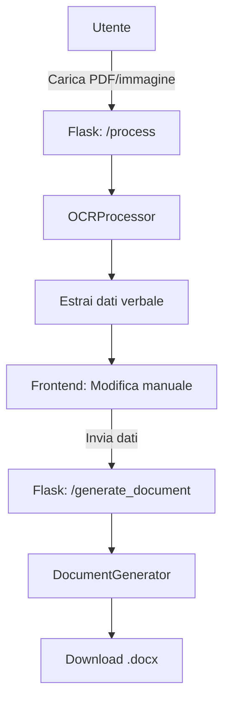

# Piano di Implementazione

Questo documento descrive i passaggi per implementare il flusso di caricamento, estrazione OCR, modifica e generazione del verbale.

## Diagramma del flusso

## Passaggi dettagliati

1. **Interfaccia di upload** (`/process`)  
   - Caricamento file PDF o immagine tramite form HTML o Streamlit  
   - Salvataggio temporaneo del file  
   - Chiamata a `OCRProcessor.process_document(file_path)`  

2. **OCR e parsing**  
   - Se disponibile, utilizzo dell'API Mistral OCR (`https://api.aimlapi.com/v1/ocr`)  
   - Fallback locale con PyMuPDF + Tesseract  
   - Restituzione di un oggetto `OCRResult` con attributo `markdown`  

3. **Estrazione campi** (`extract_verbale_data`)  
   - Parsing del testo Markdown per estrarre:  
     - Nome Assemblea, Data, Ora  
     - Presidente, Segretario  
     - Presenti, Assenti  
     - Ordine del Giorno (punti ed esiti)  
   - Restituzione di un dizionario `verbale_data`  

4. **Visualizzazione e modifica**  
   - Rendering dinamico di un form basato sulle chiavi di `verbale_data`  
   - Permettere all'utente di correggere/modificare i valori  
   - Invio dei dati modificati al server  

5. **Generazione del documento** (`/generate_document`)  
   - Ricezione di `verbale_data` come JSON  
   - Utilizzo di `DocumentGenerator` per aprire il template Word (`templates/template.docx`)  
   - Sostituzione dei placeholder `[KEY]` con i valori corrispondenti  
   - Salvataggio e restituzione del file `.docx` per il download  

## Componenti da implementare
- Wrapper HTTP per Mistral OCR (URL e base64)  
- Fallback OCR con PyMuPDF e Tesseract  
- Parser Markdown → dizionario  
- Template Word con placeholder  
- Frontend (Flask o Streamlit) per gestione form dinamici  
- Gestione degli errori e pulizia dei file temporanei  
- Test end-to-end